# AgentLatch

**Let agents reason. Let transactions coordinate.**

AgentLatch is an open-source Python execution engine and deterministic state coordinator for asynchronous AI agents, with a React + TypeScript operations console. CrewAI agents can use Ollama, OpenAI, Anthropic, Gemini, or compatible endpoints. An offline simulator reproduces concurrency failures without an API key.

**Status:** working local MVP, not a distributed production database or a proof of semantic correctness. All protected state changes must go through AgentLatch. Coordination uses established transactional techniques; the project applies them at the agent proposal/commit boundary.

## Problem statement: autonomous multi-agent synchronization

Independent AI agents can reason correctly about **different versions of the same world**. In a shared workflow, one agent may change an inventory schema while another is still generating a write from an older snapshot. If both write directly to the database, the later write can silently undo valid work or violate the new contract.

The challenge is to make asynchronous agent proposals safe to apply even when their context is stale, messages are delivered again, workers stall, or agents repeatedly make no progress. AgentLatch addresses this at an explicit proposal/commit boundary using established transaction and concurrency-control techniques.

| Failure | Concrete example | Our implemented safeguard |
| --- | --- | --- |
| Lost update | A and B read 10; both write 11; one increment disappears | Validate read versions atomically; reject stale proposals and replan from a fresh snapshot |
| Stale schema | A renames `count` to `available`; B writes the old `count` shape | Track data **and** schema versions; validate the proposed state against its contract |
| Partial-lock deadlock | A holds inventory and waits for orders; B holds orders and waits for inventory | Acquire the complete declared resource set atomically or acquire nothing |
| Stale worker | A worker resumes after its lease has expired | Check lease ownership, expiry, and monotonically increasing fencing tokens |
| Duplicate delivery | A successful operation is submitted again after a timeout | Return the durable idempotency receipt without applying the operation twice |
| No-progress loop | New operations repeatedly produce the same transition | Limit repeated transitions and enforce attempt budgets and deadlines |
| Broken workflow invariant | A transfer creates or loses inventory across two resources | Validate declared conservation rules inside the atomic commit |

## Our solution: reason concurrently, commit safely

1. **Read:** give each task a consistent snapshot with data/schema version stamps.
2. **Propose:** a CrewAI specialist and reviewer produce a typed proposal outside the database transaction. Independent task crews can run concurrently.
3. **Coordinate:** acquire the declared resource leases and validate versions, fencing, schema, and configured invariants.
4. **Commit or recover:** atomically persist accepted state, receipt, and event; reject a stale proposal and retry with fresh context within the execution budget.
5. **Observe:** inspect runs, versioned resources, rejection reasons, retries, and final outcomes in the React console.

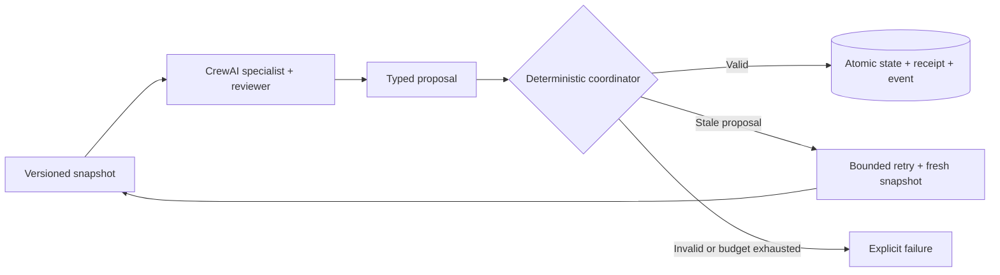

**Scope:** the coordinator is deterministic; model outputs and worker arrival order are not. Protection covers declared dependencies and coordinator-managed writes. It does not establish general semantic correctness, coordinate arbitrary external side effects, or provide distributed high availability. See [architecture and guarantees](docs/architecture.md).

## Working application

The screenshots below show the running local React console. Replay comparisons are explanatory illustrations; recorded events and workflow/resource views come from actual coordinator data. The configured `gemma4:31b-cloud` model runs through local Ollama with **cloud inference**.

### Workspace and CrewAI runtime

Choose a scenario and runtime, start a workflow, and inspect accepted operations and rejected unsafe proposals. Each task crew uses a specialist and a state reviewer.

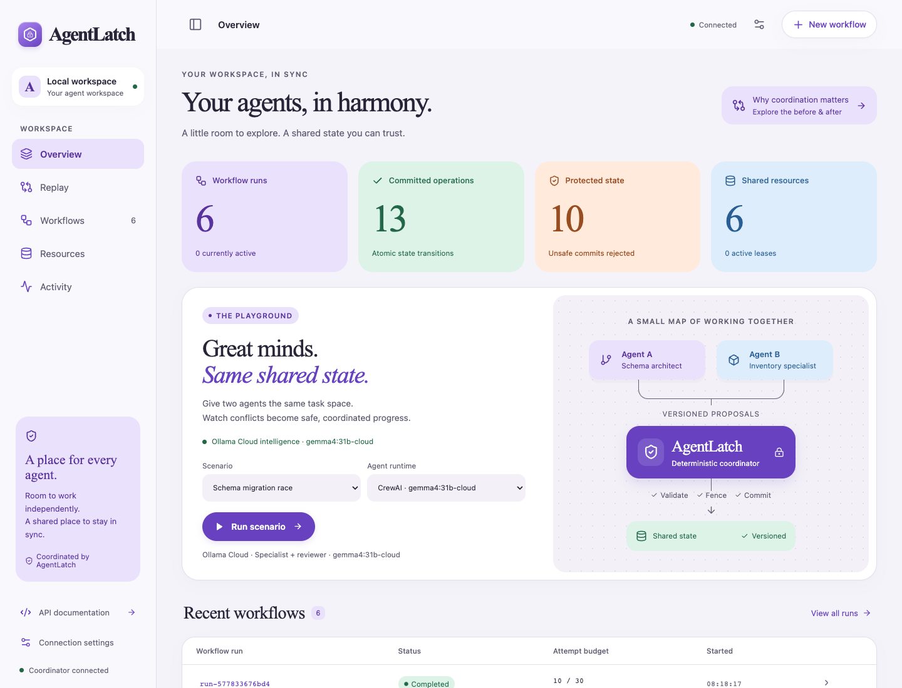

### Lost updates: preserve both agents’ work

**Problem:** both agents read `count: 10` and independently propose `11`. Unchecked writes leave `11`, losing one increment. **Solution:** reject the stale proposal, refresh its snapshot, and replan to reach `12`. This is the final frame of the explanatory replay.

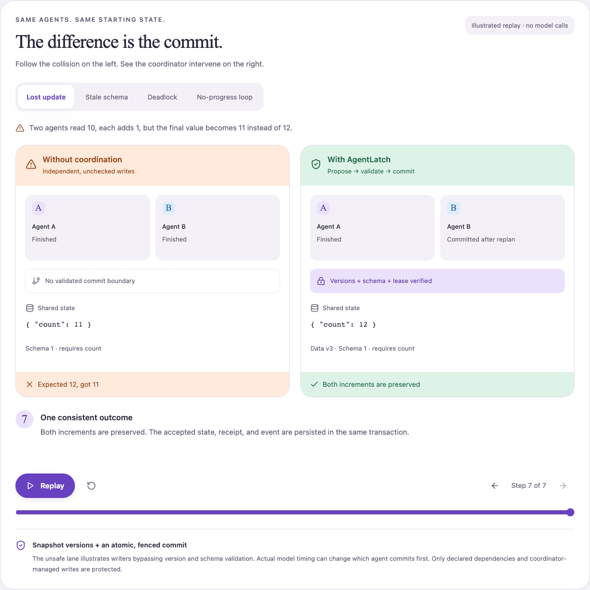

### Stale schemas: reject outdated assumptions

**Problem:** Agent A migrates `count` to `available` while B still reasons about `count`. **Solution:** detect the version mismatch before mutation, retain the migrated state, and retry with the new contract. The screenshot pauses at rejection; later replay steps show recovery.

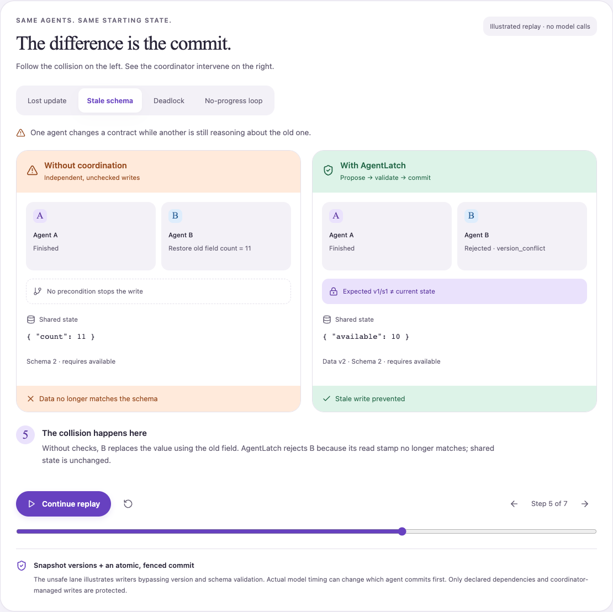

### Deadlocks: eliminate partial-resource hold-and-wait

**Problem:** agents acquire resources separately in opposite orders and wait on each other. **Solution:** grant the complete declared resource set or none, allowing the current owner to finish. This illustrates application-level leases, not a claim that all database contention is eliminated.

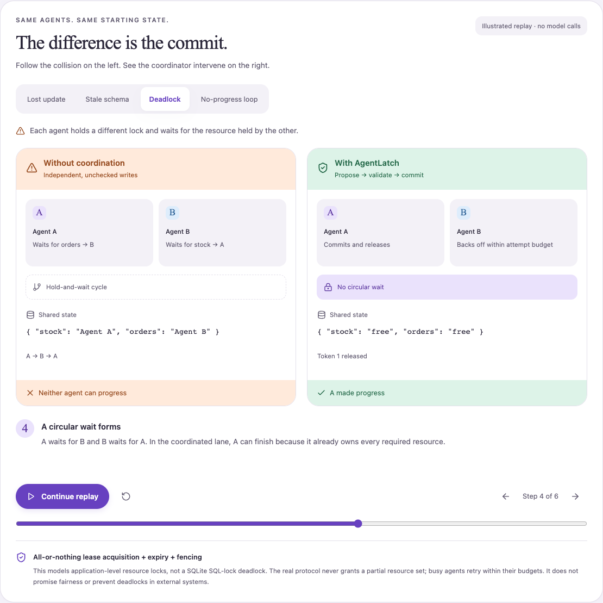

### No-progress loops: stop explicitly

**Problem:** distinct operations repeatedly propose the same transition without useful progress. **Solution:** enforce a repetition limit alongside attempt budgets and deadlines. The protected outcome is a bounded failure rather than endless model calls.

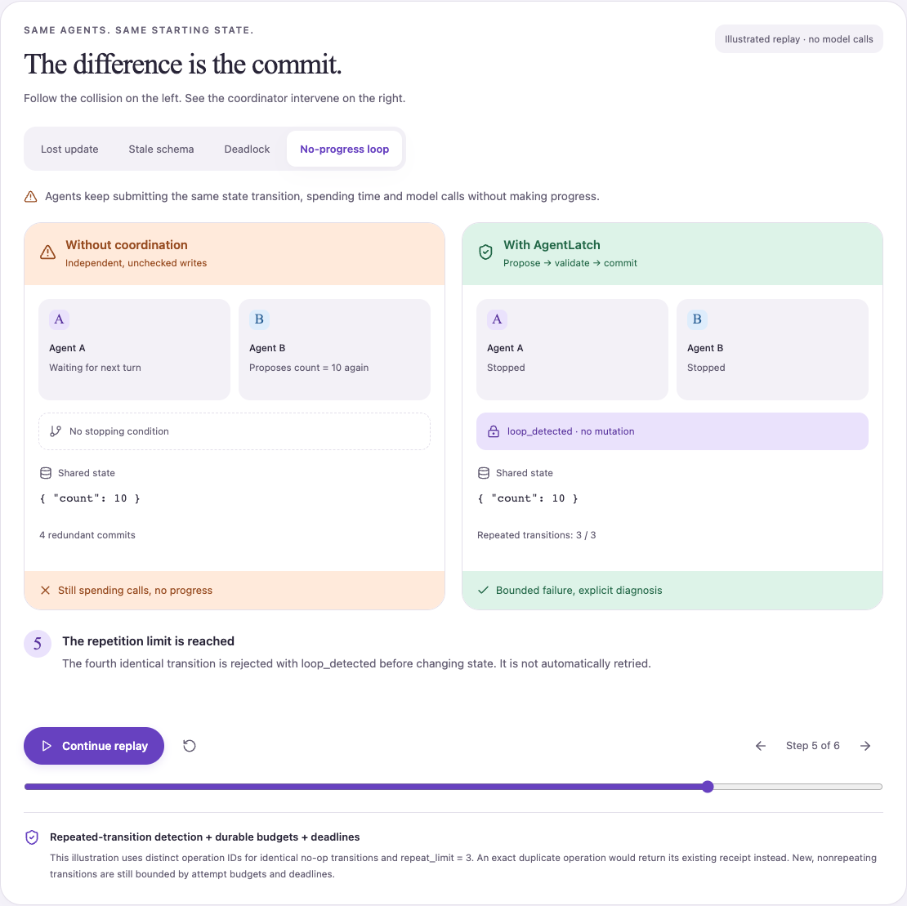

### Recorded recovery: evidence from an actual run

The console correlates real coordinator events for the same workflow and task: **#92 stale write rejected → #93 retry requested → #96 commit accepted**. Completion is also recorded for `run-577833676bd4`. These records are separate from the replay illustrations and depend on the events loaded in the session.

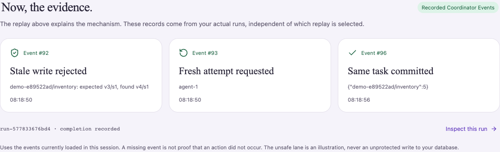

### Workflow history and execution budgets

Inspect completed or cancelled runs and the attempts they consumed. The screenshot shows the existing local demonstration history; totals will change as more workflows run.

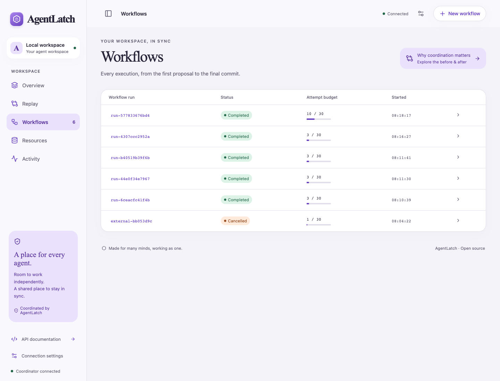

### Versioned resources and schema inspection

Inspect authoritative values together with data/schema versions. The resource sheet exposes the current JSON value and its JSON Schema so a migration can be verified directly.

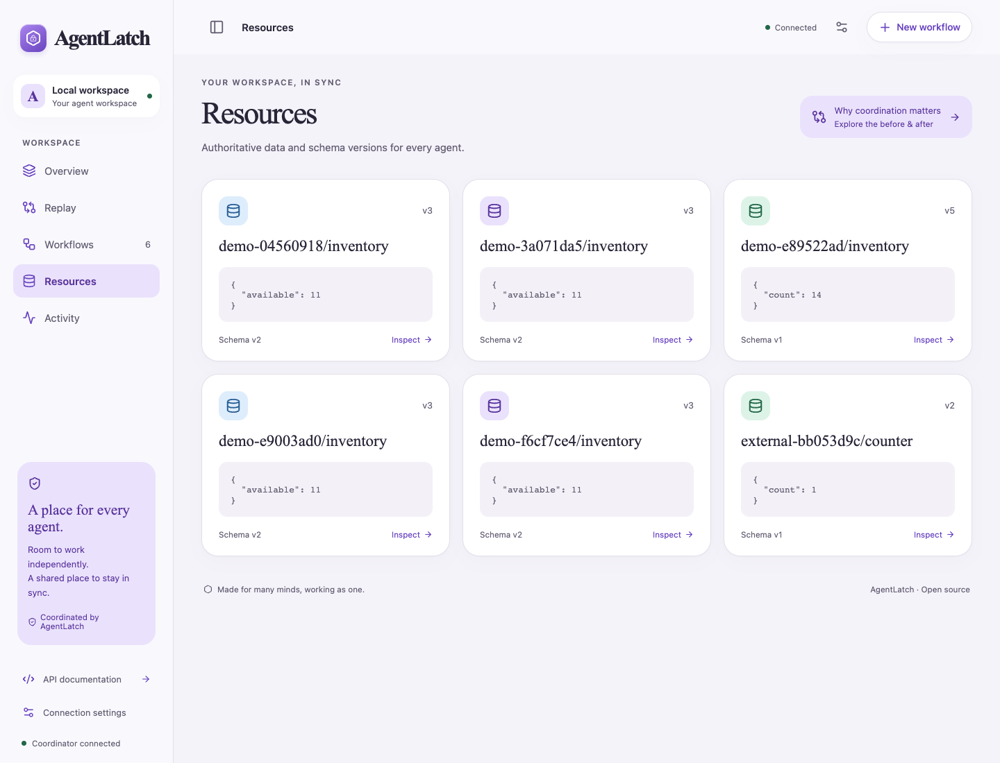

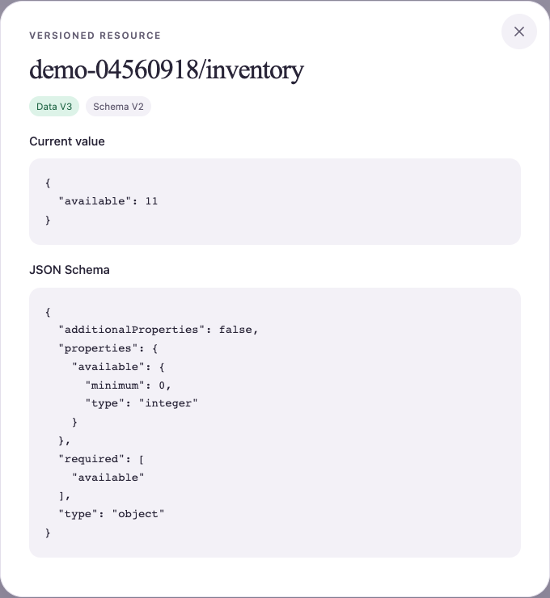

### Activity journal

Follow the persisted decisions behind the current state: attempts, leases, rejected proposals, retries, accepted commits, and workflow completion. The UI displays the latest 80 matching events from its bounded session buffer.

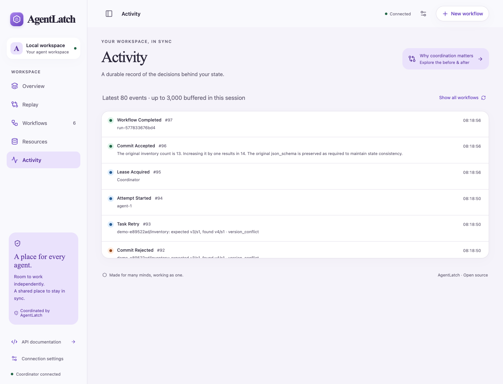

### Custom workflows

Define resources, goals, dependencies, and write scopes in JSON, then choose the runtime. This screenshot shows the creation form; capturing it does not submit a workflow.

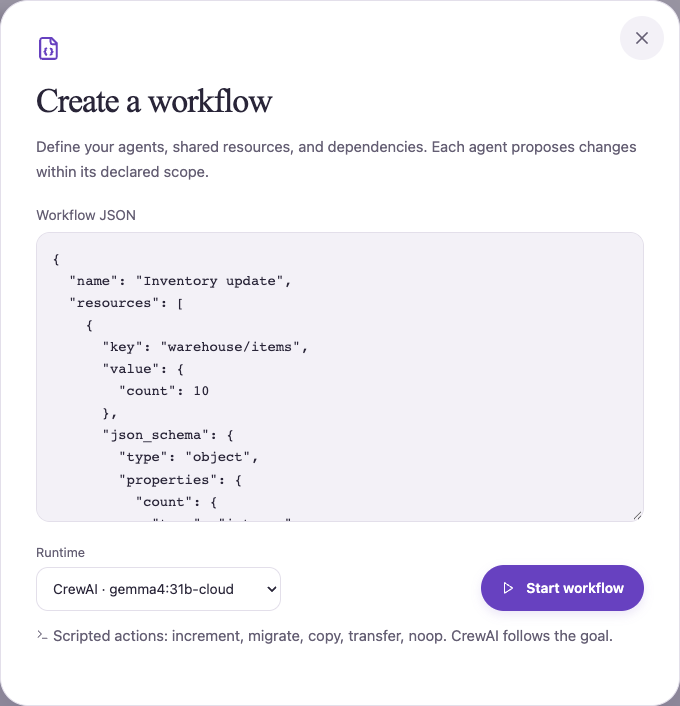

### Tablet layout

The same React app adapts to a compact viewport with a bottom navigation bar, colorful state summaries, and touch-sized controls.

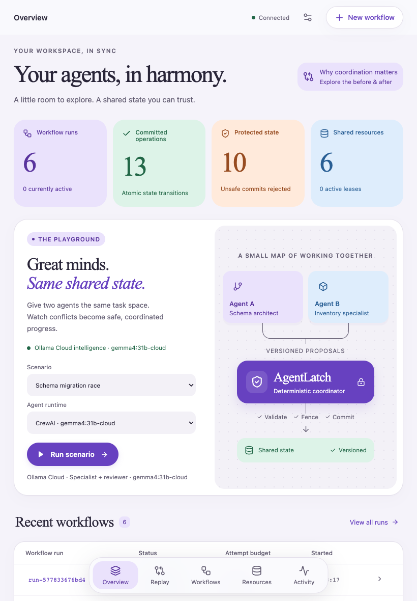

Screenshots were captured from the running app on 2026-09-21 using existing local demonstration data, with no mocked API responses. See [capture notes](docs/screenshots/README.md) and the [interactive replay guide](docs/replay.md).

## Quick start

Requirements: Python 3.12 or 3.13, [uv](https://docs.astral.sh/uv/), Node.js 22.12+.

```sh
uv sync --group dev
cd frontend
npm ci
npm run build
cd ..
uv run --extra crew agentlatch serve
```

Open **http://127.0.0.1:8000** for the console and **http://127.0.0.1:8000/docs** for interactive API documentation. Click **Run scenario** to reproduce a schema migration racing with an inventory update. The event timeline shows the stale commit being rejected and the agent replanning against the new schema.

```sh
# Terminal-only demonstrations; no models or API keys needed
uv run agentlatch demo --scenario schema
uv run agentlatch demo --scenario race
uv run agentlatch run examples/inventory.json
uv run agentlatch state

# Verification
uv run pytest
uv run ruff check .
cd frontend && npm run build
```

## Real agents

```sh
uv sync --extra crew --group dev
cp .env.example .env
# Install/start Ollama separately, then:
ollama pull gemma4:31b-cloud
uv run --extra crew agentlatch demo --mode crew
```

The supplied `.env.example` selects `ollama_chat/gemma4:31b-cloud` through localhost Ollama. This tag uses **cloud inference**, not on-device generation; sign in to Ollama if required. For on-device inference, select a downloaded model and set `AGENTLATCH_LOCAL_ONLY=true`. Set `AGENTLATCH_MODEL` and any relevant provider key in `.env`. Set `AGENTLATCH_ENABLE_CREW=true` to enable CrewAI runs from the console. The CLI's explicit `--mode crew` also opts into model calls. See [provider setup](docs/providers.md) for Ollama, OpenAI, Anthropic, Gemini, and compatible local servers. No credentials are stored in the browser or database.

## What is implemented

- Consistent snapshots with data and schema version stamps; atomic multi-resource commits.
- Deterministic conservation invariants that reject inventory creation/loss across transfers.
- All-or-nothing leases, monotonic fencing tokens, expiry, and stale-writer rejection.
- Durable idempotency receipts, event history, attempt budgets, deadlines, and repeated-transition limits.
- DAG validation, asynchronous independent tasks, bounded conflict retries with fresh snapshots, and recovery of interrupted runs.
- CrewAI agents producing typed proposals in isolated worker processes; no direct database tools.
- React console with demos, run inspection, resource inspection, timeline, custom JSON workflows, and cancellation.
- FastAPI coordinator protocol for external workers; optional bearer authentication.

## Documentation

Start at the [documentation index](docs/README.md).

| Document | Contents |
| --- | --- |
| [Visual replay](docs/replay.md) | Four before/after scenarios, controls, real event evidence, and boundaries |
| [Architecture / HLD](docs/architecture.md) | Scope, components, trust boundary, deployment topology, guarantees |
| [Low-level design](docs/low-level-design.md) | Modules, database schema, state machine, transaction algorithm |
| [Flow diagrams](docs/flows.md) | Execution flow, race resolution, fencing, cancellation, recovery |
| [API](docs/api.md) | Endpoints, request fields, errors, external worker protocol |
| [Workflows](docs/workflows.md) | Specification, dependencies, extension guide, examples |
| [Providers](docs/providers.md) | Local models and cloud configuration |
| [Operations](docs/operations.md) | Installation, tests, Docker, security, recovery, troubleshooting |
| [Decisions](docs/decisions.md) | Design choices and alternatives |
| [Roadmap](docs/roadmap.md) | Delivered scope, known limits, production milestones |

## Development

```sh
# Terminal 1
uv run --extra crew agentlatch serve
# Terminal 2
cd frontend && npm ci && npm run dev
```

Vite proxies `/api` and `/health` to port 8000. The production UI build is placed in the Python package's `static/` directory. See [CONTRIBUTING.md](CONTRIBUTING.md). Apache-2.0 licensed.
