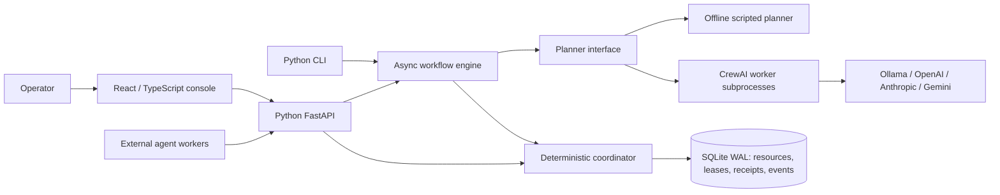
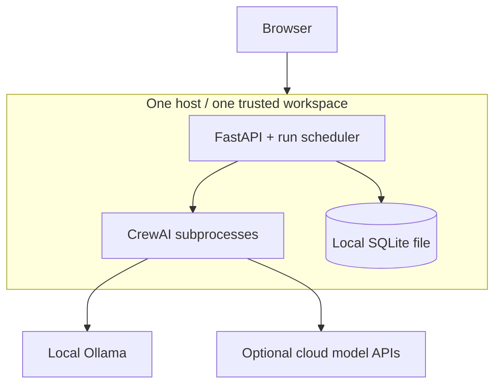

# Architecture / high-level design

## Problem and scope

Independent agents can plan against the same state, overwrite each other's updates, or act on an API contract that another agent has changed. Delegation can also cycle indefinitely. AgentLatch establishes an explicit **snapshot → proposal → validated commit** boundary around those agents.

Database transactions, optimistic concurrency, leases, fencing, and durable workflow systems already address parts of this problem. AgentLatch integrates these techniques with versioned agent context and CrewAI proposals; it does not claim to invent a new consensus protocol or solve arbitrary semantic correctness.

## System context

## Component responsibilities

| Component | Responsibility | Deliberately excluded |
| --- | --- | --- |
| React console | Start runs, inspect shared state and events, cancel execution | Model keys, direct database access |
| FastAPI | Validate transport models, authenticate optional bearer token, expose protocol | Semantic reasoning |
| Engine | Validate DAG, schedule ready tasks, reserve attempts, replan conflicts | Deciding if arbitrary model reasoning is true |
| CrewAI adapter | Construct specialist agents and structured plans from fresh snapshots | Tools that mutate shared state or perform external actions |
| Coordinator | Compare versions, validate schemas, fence stale writers, commit atomically | Model calls, remote network requests |
| SQLite | Durable transactions and serialization on one host | Multi-host replication or consensus |

## Core invariants

1. Every managed write declares an expected data and schema version. Blind writes are rejected.
2. Every declared dependency is rechecked in the commit transaction, including read-only dependencies.
3. All resources in the read set require the same live lease token and owner.
4. A lease request gets all resources or none. It never holds a partial set while waiting.
5. Data, schema, receipt, attempt status, transition counter, and accepted event commit together.
6. An operation ID can commit only once; identical duplicates receive the original result.
7. Every new attempt consumes durable workflow budget before planning. Retries do not reset it.
8. Terminal or expired workflows cannot accept new commits, except returning an already committed receipt.
9. The built-in engine binds plan reads to the supplied snapshot and restricts writes to the task's declared scope.

These guarantees apply to code paths through this coordinator. External SQL writes, untracked API changes, omitted read dependencies, or side effects outside this database bypass them.

## Semantic consistency

Each snapshot includes authoritative JSON Schema and a `schema_version`. If another agent migrates the contract during planning, the older proposal is rejected. The retry receives current values and schema and plans again. A schema migration must supply data that validates against the replacement schema in the same transaction.

This detects changed context; it does not prove the agent understood the contract or chose a sensible action. JSON Schema validates structure and configured constraints. Cross-resource business invariants, contract compatibility checks, authorization policies, and domain-specific correctness checks require additional deterministic validators.

## Concurrency model

Independent tasks run concurrently with a default limit of four. Inference happens outside transactions and outside leases. Only the short commit phase acquires an all-resource lease and a SQLite write transaction. A losing proposal releases its lease, consumes another attempt, rereads, and replans with jittered backoff.

SQLite `BEGIN IMMEDIATE` serializes writers. One SELECT supplies the entire read snapshot. WAL permits readers while another connection writes. The resulting order is determined by successful transaction arrival; there is no promise that independent runs will choose identical ordering.

## Deployment topology

Use a single API scheduler process in this MVP. Separate trusted worker processes may share the database through the API or local coordinator. Do not place the database on NFS or run independent replicas with separate files. Cross-process coordinator safety is tested; high availability and distributed scheduler ownership are not implemented.

## Security and privacy boundary

Agents get data and schemas, not database credentials or mutation tools. Schema references are local only. Provider keys remain server-side. CrewAI telemetry is disabled in worker environments. Resource content is sent to the selected provider for CrewAI runs; use Ollama for local inference. Bearer auth protects API routes when configured, but is a workspace-wide credential, not tenant isolation. The console does not persist its bearer token. See the [operations guide](operations.md) for exposure limits.
