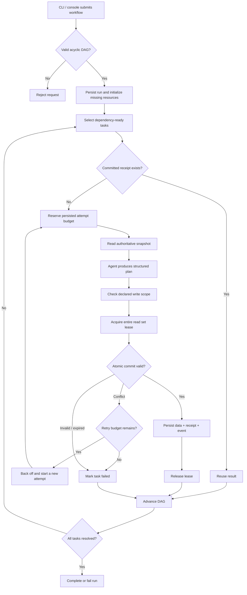
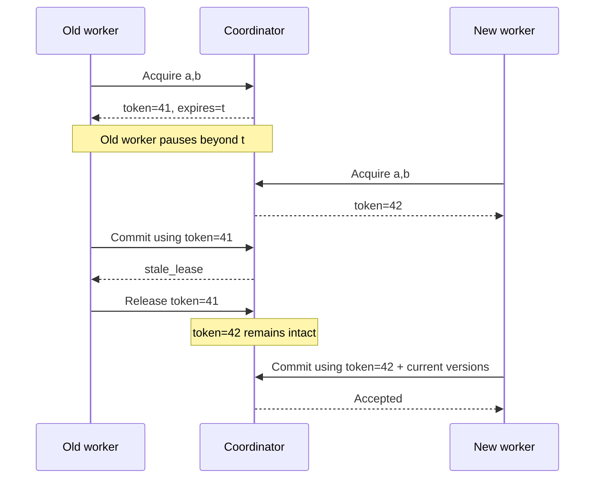
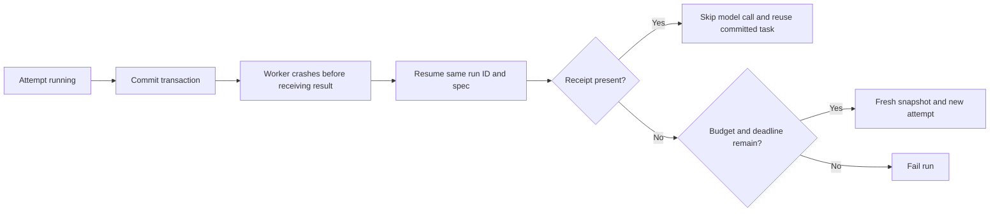
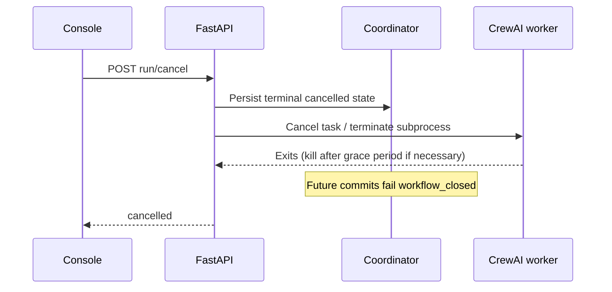

# Flow-level diagrams (FLDs)

## 1. End-to-end workflow



On any attempt exit, the engine releases its lease and abandons an uncommitted attempt. Dependencies of failed tasks are skipped. Independent tasks may still finish; there is no whole-workflow rollback.

## 2. Schema migration race

```mermaid
sequenceDiagram
    participant A as Schema architect
    participant B as Inventory agent
    participant C as Coordinator
    participant DB as Shared state
    A->>C: Snapshot inventory
    C-->>A: count=10, data v1 / schema v1
    B->>C: Snapshot inventory
    C-->>B: count=10, data v1 / schema v1
    A->>C: Lease + propose available=10 and new schema
    C->>DB: Atomic migration
    DB-->>C: data v2 / schema v2
    C-->>A: Accepted receipt
    B->>C: Lease + propose count=11 with v1/s1
    C-->>B: version_conflict; no write
    B->>C: Fresh snapshot
    C-->>B: available=10, v2/s2
    B->>C: New budgeted attempt; available=11 with v2/s2
    C->>DB: Commit data v3 / schema v2
    C-->>B: Accepted receipt
```

The offline schema demo deliberately delays the inventory agent long enough to reproduce this conflict. Real model timing varies; a real CrewAI run may complete without colliding.

## 3. Lease expiry and fencing



## 4. Crash recovery / idempotency



## 5. Cancellation



Already committed operations remain committed. Terminating the local worker cannot guarantee that a remote provider cancels an already submitted generation or stops billing it.
