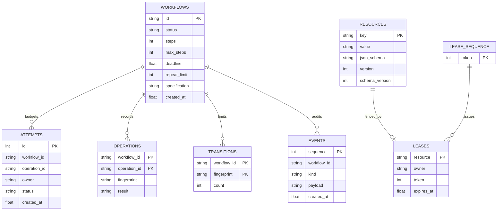
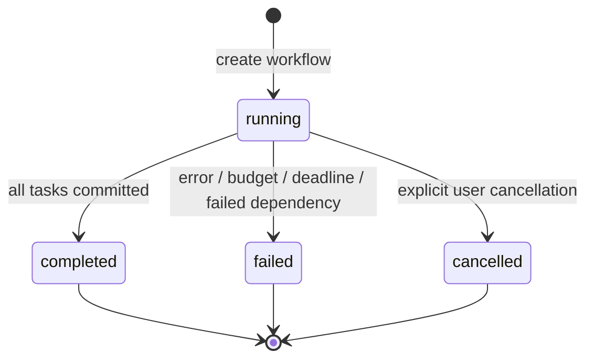
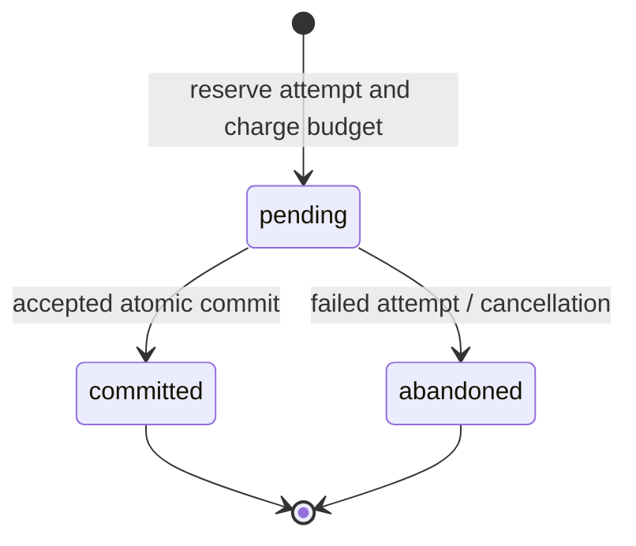

# Low-level design

## Source layout

```text
src/agentlatch/
  models.py          Strict Pydantic transport and workflow models
  coordinator.py     Validated storage transactions, leases, versions, receipts, audit log
  storage.py         SQLite/PostgreSQL connections and serialized transactions
  durable.py         Scheduler claims, heartbeat checks, persisted outcomes
  scheduler.py       Replica-safe polling and bounded active run count
  messaging.py       Versioned channels, mailbox/outbox, delivery fencing
  dispatcher.py      Operator-configured HTTP effect delivery
  policies.py        Conservation, numeric bounds, approved schema hashes
  engine.py          DAG scheduling and bounded attempt/retry execution
  planners.py        Offline simulator and cancellable subprocess adapter
  crew_worker.py     CrewAI Agent / Task / Crew construction and LLM configuration
  api.py             FastAPI routes and background run lifecycle
  cli.py             serve / demo / run / state commands
  demo.py            Reproducible, namespaced conflict scenarios
  static/            Generated React production build
frontend/src/
  App.tsx            Console, polling, run creation, state and event inspection
  styles.css         Responsive visual system and reduced-motion handling
```

## Data model / ER diagram



Relationships are enforced by coordinator code; the MVP DDL does not declare foreign keys. JSON values are stored as canonical JSON text. Timestamps are UTC Unix seconds. `lease_sequence.token` and `events.sequence` use SQLite AUTOINCREMENT. Never reset the sequence while clients can hold old tokens.

| Table | Important behavior |
| --- | --- |
| resources | Initialized at data/schema version 1; every accepted write increments data version, even a no-op |
| workflows | Immutable identity/specification check, persisted attempt count, absolute deadline |
| leases | One row per resource, token shared by an atomic acquisition; expired rows are overwritten |
| lease_sequence | Monotonic generations across releases and process restarts |
| attempts | Pending, committed, or abandoned; reserved before inference |
| operations | Unique logical operation receipt and payload fingerprint |
| transitions | Version-independent transition fingerprint count per workflow |
| events | Ordered append-only application audit history; not a full event-sourced state reconstruction log |

## Commit algorithm

Inside one SQLite `BEGIN IMMEDIATE` or PostgreSQL advisory-locked transaction:

1. Hash canonical read stamps and plan. If a receipt exists, return it when the hash matches; otherwise reject ID reuse.
2. Check workflow existence, running status, absolute deadline, and scheduler generation for managed runs.
3. Check that the supplied attempt is pending and matches workflow, operation, and owner.
4. Require writes in the read set and enforce persisted task read/write scope.
5. For every read key, check lease owner, token, expiry, and both resource versions.
6. Validate all proposed values against current or proposed JSON Schema before changing anything.
7. Enforce configured conservation, numeric, and schema-allowlist invariants over current and fully proposed state. Hash input state and proposed output independently of version counters. Reject excessive repeats.
8. Update resources and version counters. Stage validated envelopes and consumed-message ACKs; insert receipt and transition count, mark attempt committed, append events.
9. Commit the transaction. On error, roll back; record a rejection in a separate transaction.

A crash after commit but before delivery is safe: the next identical delivery returns the durable receipt. A crash before commit leaves no partial data changes. A crash before the rejection event can omit that event; it cannot partially apply the rejected write.

## State machines





A killed process can leave a workflow running and an attempt pending. The scheduler automatically reclaims expired ownership, abandons interrupted attempts, skips committed operations, and resumes unfinished work. Graceful shutdown releases ownership for recovery. Explicitly cancelled/failed runs are terminal. Remaining task/workflow budgets and original deadlines still apply.

## Loop and deadlock controls

- DAG validation rejects unknown dependencies and cycles before execution.
- No agent-held resource lock survives inference.
- Lease acquisition is all-or-nothing, so resources cannot form a hold-and-wait cycle in this protocol.
- Retries have per-task maximum attempts and a shared durable workflow step budget.
- Workflow deadlines are checked before planning and inside commit.
- Repeated transitions are rejected after `repeat_limit`; alternating repeated states are eventually stopped. Fresh but meaningless transitions are bounded by steps/deadline.
- CrewAI delegation is disabled; iteration/retry limits cap internal reasoning. The worker subprocess is terminated on runtime cancellation/timeout.

## Frontend behavior

The React console polls state and new events roughly every 1.2 seconds, using an event sequence cursor. It retains the latest 3,000 events in memory and displays up to 80 for a filter. The API retains the full event table until an operator archives it. Model credentials never reach React. UI assets are served by FastAPI after a Vite production build. Server state is authoritative; the UI does not optimistically mutate resource values.

## Reliability tables

| Table | Role |
| --- | --- |
| schema_migrations | Additive schema generation; current generation 2 |
| run_jobs | Workflow ID, immutable planner mode, scheduler owner, generation, expiration |
| task_outcomes | Terminal per-task result keyed by workflow/task |
| channels | Immutable JSON Schema keyed by destination/kind/version |
| deliveries | Stable ID, source workflow/operation/read context, payload, status, owner/token, attempts and availability |

PostgreSQL uses BIGSERIAL for generated IDs and DOUBLE PRECISION for epoch timestamps. Scheduler/delivery checks use the database clock. See [reliability](reliability.md) for transaction boundaries, claim recovery, and outbox delivery semantics.
