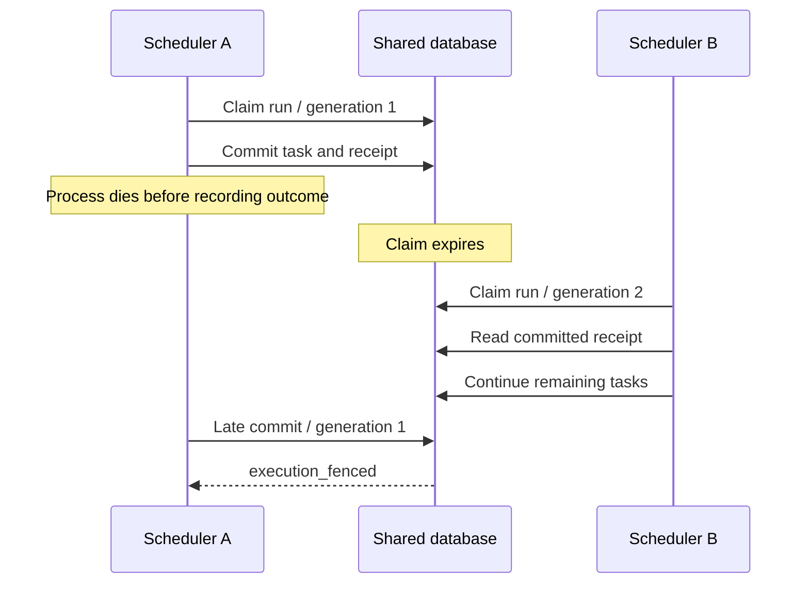
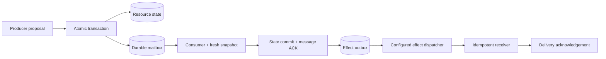

# Durable execution and communication

## Delivered scope

The coordinator now supports SQLite for local use and PostgreSQL for a shared database across scheduler replicas. Accepted state changes can atomically publish schema-validated agent messages and external-effect requests. Numeric bounds, maximum integer deltas, conservation, and schema-hash allowlists provide deterministic domain constraints.

This is a tested implementation, not certification of enterprise readiness. All replicas must share one authoritative database and compatible code/configuration. PostgreSQL failover, network partitions, load at production scale, tenant isolation, and third-party receiver correctness remain deployment acceptance work.

## Storage and ordering

`AGENTLATCH_DB` accepts a file path or a PostgreSQL URI. Install PostgreSQL support with `uv sync --extra postgres --extra crew --group dev`; preserve extras when running uv commands, or use `uv run --no-sync` after installation.

SQLite uses `BEGIN IMMEDIATE`. PostgreSQL uses explicit transactions and a transaction-scoped advisory lock shared by **all coordinator mutations**. This conservative design serializes writers and preserves validation/commit ordering across replicas. It prioritizes correctness over maximum write throughput; sharded locking is future optimization. PostgreSQL lease and deadline decisions use the database clock. Inference and HTTP delivery occur outside transactions.

Sources: [Psycopg transaction management](https://www.psycopg.org/psycopg3/docs/basic/transactions.html), [PostgreSQL transaction advisory locks](https://www.postgresql.org/docs/17/functions-admin.html#FUNCTIONS-ADVISORY-LOCKS).

## Durable scheduler

A run is persisted with its exact specification and planner mode before HTTP 202 is returned. The mode cannot change on recovery. `run_jobs` stores owner, generation, and expiration. A claimant atomically advances the generation; a heartbeat renews the default 30-second claim every 10 seconds. A restarted or competing scheduler can claim expired work. Graceful shutdown releases claims without cancelling the workflow. Explicit user cancellation remains terminal.

Attempts and commits check the current scheduler generation. Expired or replaced owners cannot reserve new attempts, change managed state, save outcomes, or finish a run through the fenced engine path. Existing successful receipts remain retrievable after ownership changes. Task outcomes persist; a crash after commit but before saving an outcome is recovered through the operation receipt. Failed/skipped outcomes are not silently retried after restart. Interrupted attempts still consume budget.

The scheduler polls every 250ms and limits concurrently owned runs to `AGENTLATCH_MAX_RUNS` (default 4) **per process**. A run schedules task waves with up to four concurrent tasks. This is not a global quota across all replicas. Heartbeat/storage failures cancel local inference; claim expiry enables another scheduler to recover. Expired workflow deadlines are swept to failed even after a crash.



Run multiple `agentlatch worker` processes against the same PostgreSQL URI. Each API server also schedules by default; set `AGENTLATCH_SCHEDULER_ENABLED=false` on API-only processes. Crew-capable schedulers require `AGENTLATCH_ENABLE_CREW=true` and matching model/provider configuration. Model settings remain global configuration, so pin them consistently across replicas; the persisted planner mode alone does not pin a model version.

## Mailbox and transactional outbox

An envelope has `id`, `kind` (`message` or `effect`), `destination`, `schema_version`, and `payload`. Register an immutable channel contract for each destination/kind/version using `/api/channels`. Changing a contract requires a new version.

A task declares allowed `destinations`. Its Plan can publish envelopes only to those destinations. Optional task `emits` templates require matching IDs, kinds, destinations, and versions in the final proposal; payloads must satisfy the channel schema. ScriptedPlanner copies templates, while CrewAI generates the Plan from the task, snapshot, and templates.

Each delivery's stable ID hashes workflow ID + operation ID + envelope ID. The commit atomically stores resource changes, operation receipt, queued envelopes, consumed-message acknowledgements, and accepted events. Invalid destinations, contracts, or acknowledgements roll back all of it. Exact duplicate commits do not duplicate envelopes.

A task with `inbox` waits for one message at that destination **within its own workflow**. It passes the envelope to the planner as untrusted data alongside a fresh authoritative snapshot. Source read stamps are provenance, not permission to bypass current-state validation. A 300-second message claim bounds an individual inbox-backed planning call to at most 240 seconds. The message is acknowledged with the consumer's successful commit; rejected attempts release it for bounded redelivery. Tasks requiring multiple inputs can be represented as separate dependencies/tasks. A missing message eventually fails through the workflow deadline.



Delivery claims have owner, monotonically increasing token, visibility timeout, and durable attempt count. Lost acknowledgements allow redelivery of the same stable ID. Old/expired claims cannot acknowledge a newer claim. Five failed/expired attempts produce a dead letter on retry/claim processing. There is no total delivery ordering promise and no automatic dead-letter redrive; inspect and explicitly design a new recovery workflow.

The reproducible example supports both runtimes:

```sh
uv run --no-sync python examples/durable_handoff.py --mode scripted
uv run --no-sync python examples/durable_handoff.py --mode crew
```

The second command makes real model calls with configured credentials. Both use the same coordinator and message protocol; neither starts an effect dispatcher.

## External effects

Only an explicitly started dispatcher sends effects:

```sh
# Operator-controlled destination allowlist, never a URL supplied by an agent:
export AGENTLATCH_EFFECT_ENDPOINTS='{"inventory-notifications":"http://127.0.0.1:9000/events"}'
uv run --no-sync agentlatch dispatch
```

The HTTP adapter sends `{id, workflow_id, schema_version, payload}` and `Idempotency-Key: <stable delivery ID>`. URLs must be HTTP(S), cannot contain credentials, and redirects are not followed. Responses outside 2xx and timeouts cause bounded retries with backoff. No handler means an effect stays queued. Do not configure a real endpoint merely to inspect the demo.

Receivers **must durably deduplicate IDs** if repeating an effect would be harmful. A remote side effect and the local delivery acknowledgement cannot be committed atomically together. Cancellation after a remote success can still cause a retry. AgentLatch therefore promises at-least-once delivery attempts, not end-to-end exactly-once effects. Cancellation of a workflow does not retract already committed effects; compensation remains application-specific.

## Deterministic policies

All rules execute inside the commit transaction and require the full declared policy dependency set:

```json
{"invariants":[
  {"id":"safe-stock","kind":"numeric_bounds","resources":["inventory"],"field":"count","minimum":0,"maximum":1000,"max_delta":1},
  {"id":"approved-contract","kind":"schema_allowlist","resources":["inventory"],"allowed_hashes":["SHA256_OF_CANONICAL_APPROVED_SCHEMA"]}
]}
```

`numeric_bounds` requires integer before/after values and bounds each transition. `schema_allowlist` accepts only configured schema hashes, computed using `agentlatch.coordinator.digest(schema)`. `conserve_total` preserves totals across resources. These rules enforce configured domain properties; they do not prove arbitrary semantic intent, truthful messages, or backward compatibility of an allowed migration.

## Schema upgrades and recovery

Initialization adds new tables under the storage transaction and records schema generation 2 in `schema_migrations`. Existing resources, receipts, workflows, and events are preserved. Legacy receipt fingerprints and missing workflow default fields are recognized. Stop old binaries before upgrading: older coordinators do not enforce scheduler fencing. Existing running workflows from before durable enrollment need one explicit re-submission of the same specification/mode to enroll them; newly accepted runs recover automatically.

Back up before upgrades. SQLite: use its online backup API or stop all writers before copying. PostgreSQL: use `pg_dump` and a tested restore procedure. Restore only after stopping every scheduler/worker/dispatcher, since old workers may retain obsolete tokens. No cross-backend data migration command is provided; a PostgreSQL URI starts an independent store unless data is migrated separately.

## Verification and boundaries

See [verification](verification.md) for tests and real-model evidence, [benchmark results](benchmarks/README.md), and [API](api.md). The React **Reliability** view shows current/recent scheduler claims and delivery states, with a reproducible scripted handoff demo.

Workspace bearer authentication is still an administrative trust boundary. There is no per-agent identity, RBAC, multi-tenant isolation, tamper-evident audit storage, cross-database transaction, automatic compensation, or global model concurrency quota. This release does not claim those features. PostgreSQL high availability requires an operator-managed database deployment and failure drills beyond these local tests.
